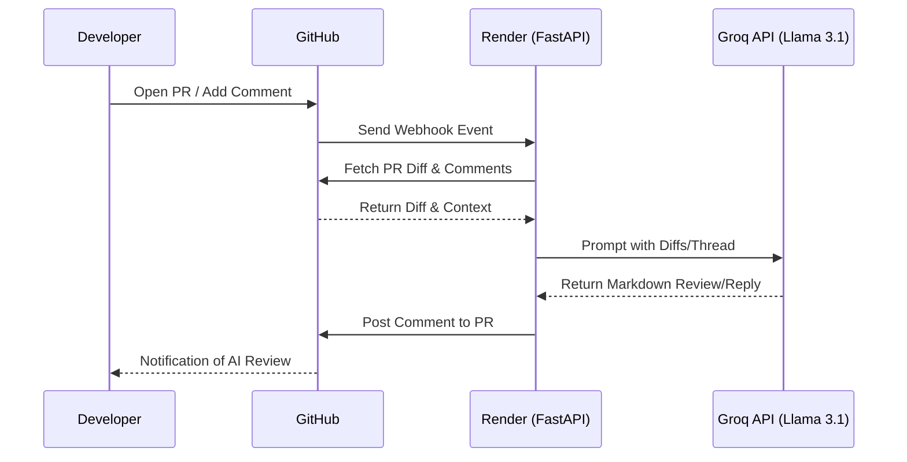

# 🚀 Antigravity PR-Reviewer: AI-Powered Code Auditor

An intelligent, lightning-fast pull request reviewer powered by **Groq** and **Llama 3.1**. Gawish-PR-Reviewer acts as a vigilant senior engineer, automatically analyzing code changes, highlighting bugs, checking security vulnerabilities, and actively discussing the code with you right inside GitHub!

---

## 📖 Overview

The Antigravity PR-Reviewer connects seamlessly to your GitHub repositories via webhooks. On every Pull Request or discussion comment, it instantly pulls the code diffs, analyzes them using Groq's high-speed inference engine (running Llama 3.1 8B), and posts a professional, formatted review.

No more waiting for human reviews on basic syntax, performance bottlenecks, or security oversights. 

## ✨ Key Features

- **🤖 Automated PR Reviews**: Instant feedback on every pull request push.
- **🛡️ Security Analysis**: Proactively detects hardcoded keys, SQL injection risks, and insecure imports.
- **⚡ Performance Checks**: Flags inefficient loops and unnecessary memory usage.
- **💡 Clean Code Suggestions**: Enforces PEP-8 readability, missing docstrings, and proper architecture.
- **💬 Interactive Discussions**: Reply to the bot's comment to start a discussion! The AI remembers the context and defends its choices or acknowledges a better point.
- **🏎️ Blazing Fast Inference**: Powered by Groq Cloud and `llama-3.1-8b-instant`.

---

## 🏗️ Architecture



---

## 🛠️ Tech Stack

- **Language:** Python 3.11+
- **Framework:** FastAPI
- **AI Model:** Llama 3.1 (`llama-3.1-8b-instant`) via Groq Cloud
- **Deployment:** Render & GitHub Webhooks

---

## 🚀 Installation & Setup

Want to run your own instance of the PR-Reviewer?

### 1. Clone the repository
```bash
git clone https://github.com/Ahmed-Rizk1/Gawish-PR-Reviewer.git
cd Gawish-PR-Reviewer
```

### 2. Configure Environment Variables
Create a `.env` file in the root directory:
```env
GITHUB_TOKEN=your_github_personal_access_token
GROQ_API_KEY=your_groq_api_key
```

### 3. Install Dependencies
We highly recommend using [uv](https://github.com/astral-sh/uv) for lightning-fast package management:
```bash
uv venv .venv
# Activate the venv (Windows)
.\.venv\Scripts\Activate.ps1 
# Activate the venv (Mac/Linux)
source .venv/bin/activate

uv pip install -r requirements.txt
```

### 4. Run the Server
```bash
uvicorn app.main:app --reload --port 8000
```
*Note: Use tools like **ngrok** to expose your local port 8000 to the internet so GitHub can reach your webhook endpoint.*

---

## 🤝 Contribution

Contributions are always welcome! Whether it's adding new models, improving the prompt, or adding support for GitLab/Bitbucket:
1. Fork the Project
2. Create your Feature Branch (`git checkout -b feature/AmazingFeature`)
3. Commit your Changes (`git commit -m 'Add some AmazingFeature'`)
4. Push to the Branch (`git push origin feature/AmazingFeature`)
5. Open a Pull Request

---

## 📄 License

Distributed under the MIT License. See `LICENSE` for more information.
